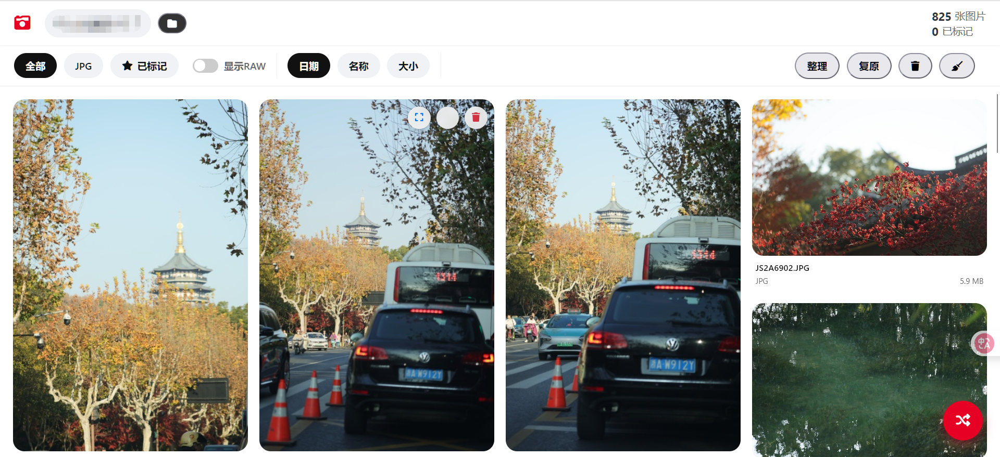
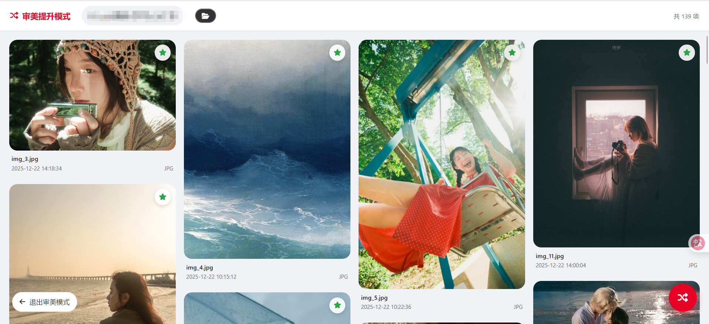

# 图片管理工具 (Image Manager)


一个轻量级、高性能的本地图片管理工具，基于 Python Flask 构建。专为摄影师和视觉创作者设计，提供流畅的瀑布流浏览体验，支持 RAW 格式预览、HEIC 自动转码、审美提升模式等高级功能。

## ✨ 核心特性

### 🚀 高效浏览与管理
- **瀑布流布局**：采用 Masonry 布局，支持海量图片流畅加载与浏览。
- **格式全兼容**：
  - **通用格式**：完美支持 JPG, PNG, WEBP, GIF, BMP 等。
  - **RAW 支持**：内置 `rawpy`，支持预览 ARW, CR2, NEF, DNG 等专业相机格式。
  - **HEIC 自动转码**：自动识别并转换 Apple HEIC/HIF 格式为 JPG，确保全平台兼容性。
- **智能整理**：
  - **一键分类**：按文件格式自动归档整理。
  - **快速标记**：星标精选照片，支持独立筛选查看。
  - **安全删除**：内置回收站机制，支持误删一键恢复。
- **系统托盘支持**：
  - **后台运行**：程序启动后自动常驻系统托盘，不占用任务栏。
  - **快速访问**：通过托盘菜单一键打开浏览器界面或彻底退出程序。

### 🎨 审美提升模式 (Aesthetic Mode)
打破文件夹限制，提供沉浸式的灵感探索体验。
- **随机漫游**：递归扫描指定根目录，将所有作品随机混排展示。
- **元数据识别**：智能解析 `.\作者\作品名\` 目录结构，展示作者与作品信息。
- **关联探索**：点击作者或作品名，即可反向筛选该系列的所有相关作品。
- **独立视图**：拥有独立的 UI 容器与状态记忆，不干扰常规文件管理。

### �️ 系统托盘 (System Tray)
为了提供更原生的应用体验，程序内置了系统托盘功能：
- **自动隐藏**：启动后程序将自动最小化到系统托盘（任务栏右下角）。
- **右键菜单**：
  - **打开浏览器**：重新打开图片管理主界面。
  - **退出**：彻底关闭后端服务。
- **状态常驻**：关闭浏览器窗口不会停止服务，确保后台任务（如转码、扫描）持续运行。

### �🛠️ 技术亮点
- **完全本地化**：所有依赖（Viewer.js, FontAwesome 等）均内置，无需联网，零外部请求。
- **懒加载优化**：支持分批次渲染与懒加载，内存占用低，响应速度快。
- **便携运行**：支持打包为单文件 EXE，无需配置环境，即插即用。

## 📦 快速开始

### 方式一：直接运行 (Windows)
1. 下载最新发布的 `dist/ImageManager.exe`。
2. 双击运行，程序将自动启动并打开默认浏览器。
3. 在顶部导航栏选择需要管理的图片文件夹即可开始使用。

### 方式二：源码运行
适用于开发者或非 Windows 环境。

1. **环境准备**
   确保已安装 Python 3.10+。

2. **安装依赖**
   ```bash
   pip install flask pillow rawpy pillow-heif pillow-avif-plugin pystray
   ```

3. **启动服务**
   - **Windows**: 双击 `start.bat` 即可自动安装依赖并启动。
   - **通用**: 运行 `python image_manager.py`。

4. **浏览器访问**

   打开浏览器访问

   ```
   http://localhost:5000/
   ```

   服务成功加载出现如下页面

   

   点击右下角进入审美提升模式

   

   ​		

## 🔨 构建指南

如果你想自己打包 EXE 文件：

1. 安装 PyInstaller：
   ```bash
   pip install pyinstaller
   ```
2. 运行构建脚本 (Windows)：
   ```bat
   .\build_release.bat
   ```
3. 构建产物将生成在 `dist/` 目录下。

## 📂 项目结构

```text
.
├── image_manager.py      # 核心后端逻辑 (Flask)
├── aesthetic_mode.py     # 审美模式扫描模块
├── templates/            # 前端模板
│   └── index.html        # 单页应用入口
├── static/               # 静态资源
│   └── vendor/           # 本地化第三方库
├── create_icon.py        # 图标生成工具
├── start.bat             # Windows 快速启动脚本
└── build_release.bat     # 打包脚本 (推荐)
```

## 📝 更新日志

### v2.1 (2025-12-25)
- **New**: 新增系统托盘支持，支持后台运行与快速菜单操作。
- **New**: 新增 AVIF 格式支持。
- **Imp**: 完善 Windows 环境下的启动脚本 `start.bat`。

### v2.0
- **New**: 新增“审美提升模式”，支持随机浏览与元数据反查。
- **New**: 新增 HEIC/HIF 格式自动转码 JPG 功能。
- **Imp**: 优化缩略图生成逻辑，支持更多色彩模式与 EXIF 旋转。
- **Imp**: 引入分批次懒加载，显著提升大图库浏览性能。
- **Fix**: 修复了部分特殊字符路径导致的预览失败问题。

### v1.0
- 基础图片浏览、整理、标记与回收站功能。
- RAW 格式预览支持。

## 📄 许可证

本项目采用 [MIT License](LICENSE) 开源。
